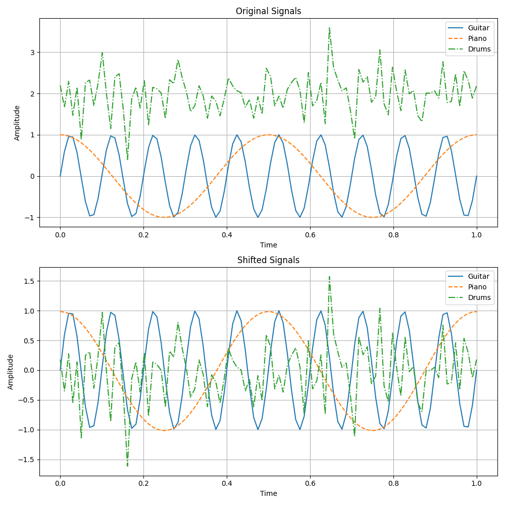

<!-- 
Author(s): Dhruv Srikanth
Email(s): dsrikant (at) andrew (dot) cmu (dot) edu
Acknowledgements:
Copyright (c) 2023 Carnegie Mellon University, Auton Lab
This code is subject to the license terms contained in the code repo.
-->

# Delta Median Preprocessor

The *delta median preprocessor* function shifts the input signal by the median of the signal. The is defined as:

$$
x_{shifted_{i}} = x_{i} - median({x}), \quad \forall i \in \{1, \dots, N\}
$$

For shifting signals by a custom $\delta$, see the [`delta preprocessor`](../functional/delta_preprocessor_fn.md) function. For more on how we compute the median of a signal, check out [`median`](../../functional/median.md) function.

::: autonfeat.preprocess.functional.delta_median_tf

## Examples

Signal equilization is a common problem in signal processing. The *delta median preprocessor* function can be used to equilize signals by shifting them by their median. This can be useful for removing the effect of a constant bias in the signal. This is often done in sound engineering when equilizing the sound of different instruments. In the example below, we generate three signals, a guitar signal, a piano signal, and a drums signal. We then apply the *delta median preprocessor* function to each signal.

### Transform Signal

We first generate the signals. Then we perform the equilization by applying the transform to each signal.

```python
import numpy as np
import autonfeat.preprocess.functional as PF

# Generating example signals for each instrument
num_samples = 100
time = np.linspace(0, 1, num_samples)
guitar_signal = np.sin(2 * np.pi * 10 * time)  # Guitar signal (higher frequency sine wave)
piano_signal = np.cos(2 * np.pi * 2 * time)  # Piano signal (cosine wave)
drums_signal = np.random.normal(2, 0.5, num_samples)  # Drums signal (random noise with higher mean)

# Applying the transform to each signal
guitar_eq = PF.delta_median_tf(guitar_signal)
piano_eq = PF.delta_median_tf(piano_signal)
drums_eq = PF.delta_median_tf(drums_signal)
```

### Visualize Transform

We can visualize the effect of the transform by plotting the original signals and the shifted signals on the same plot. We can see that the median of each signal is shifted to zero.

```python
import matplotlib.pyplot as plt

# Set up custom line styles
line_styles = ['-', '--', '-.']

# Set up custom color palette
colors = ['#1f77b4', '#ff7f0e', '#2ca02c']

# Plotting all original signals on one subplot
plt.figure(figsize=(10, 10))

plt.subplot(2, 1, 1)
for i, signal in enumerate([guitar_signal, piano_signal, drums_signal]):
    plt.plot(time, signal, color=colors[i], linestyle=line_styles[i])

plt.title('Original Signals')
plt.xlabel('Time')
plt.ylabel('Amplitude')
plt.legend(['Guitar', 'Piano', 'Drums'])
plt.grid(True)

# Plotting all shifted signals on another subplot
plt.subplot(2, 1, 2)
for i, signal in enumerate([guitar_eq, piano_eq, drums_eq]):
    plt.plot(time, signal, color=colors[i], linestyle=line_styles[i])

plt.title('Shifted Signals')
plt.xlabel('Time')
plt.ylabel('Amplitude')
plt.legend(['Guitar', 'Piano', 'Drums'])
plt.grid(True)

plt.tight_layout()
plt.show()
```

As seen in the figure, the drums signal which had a higher mean than the other signals is shifted down by a larger amount than the other signals. In doing so, we have equilized the signals.




If you enjoy using [`AutonFeat`](../../../index.md), please consider starring the [repository](https://github.com/autonlab/AutonFeat) ⭐️.