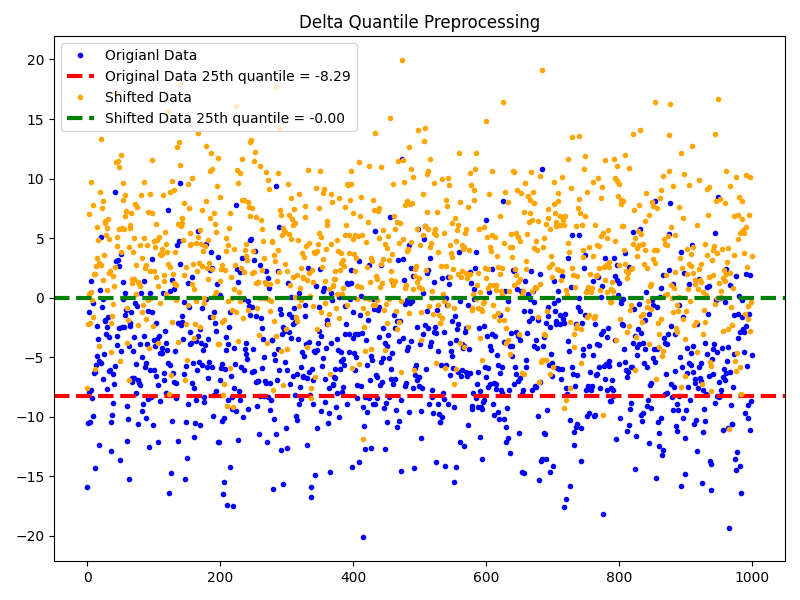

<!-- 
Author(s): Dhruv Srikanth
Email(s): dsrikant (at) andrew (dot) cmu (dot) edu
Acknowledgements:
Copyright (c) 2023 Carnegie Mellon University, Auton Lab
This code is subject to the license terms contained in the code repo.
-->

# Delta Quantile Preprocessor

The *delta quantile preprocessor* function shifts the input signal by the quantile of the signal. This is defined as:

$$
x_{shifted_{i}} = x_{i} - \text{quantile}(x), \quad \forall i \in \{1, \dots, N\}
$$

where $x_{i}$ represents an element of the input signal, $x_{shifted_{i}}$ represents an element of the output signal, and $N$ is the number of elements in the signal.

For shifting signals by a custom $\delta$, see the [`delta preprocessor`](../functional/delta_preprocessor_fn.md) function. For more on how we compute the quantile of a signal, check out [`quantile`](../../functional/quantile.md) function.

::: autonfeat.preprocess.functional.delta_quantile_tf

## Examples

### Transform Signal

```python
import numpy as np
import autonfeat.functional as F
import autonfeat.functional.preprocess as PF

# Generate data
n_samples = 1000
x = np.random.normal(-5, 5, n_samples)

q_tile = 0.25 # 25th quantile
# Preprocess data
x_shifted = PF.delta_quantile_tf(x, q=q_tile)
```

### Visualize Transform

```python
import matplotlib.pyplot as plt

# Plot normal and shifted data
original_quantile = F.quantile_tf(x, q_tile)
shifted_quantile = F.quantile_tf(x_shifted, q_tile)

plt.figure(figsize=(8, 6))

plt.plot(x, '.', color='blue', label='Origianl Data')
plt.axhline(original_quantile, color='red', linestyle='--', linewidth=3, label=f'Original Data 25th quantile = {original_quantile:.2f}')

plt.plot(x_shifted, '.', color='orange', label='Shifted Data')
plt.axhline(shifted_quantile, color='green', linestyle='--', linewidth=3, label=f'Shifted Data 25th quantile = {shifted_quantile:.2f}')

plt.legend()
plt.title('Delta Quantile Preprocessing')

plt.tight_layout()
plt.show()
```




If you enjoy using [`AutonFeat`](../../../index.md), please consider starring the [repository](https://github.com/autonlab/AutonFeat) ⭐️.