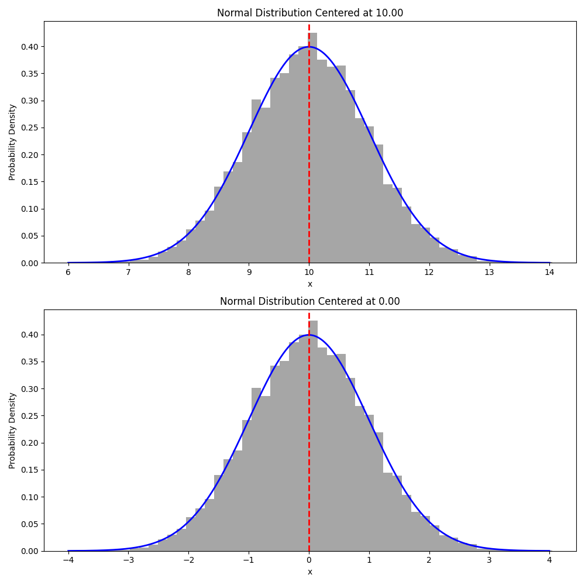

<!-- 
MIT License

Copyright (c) 2023 Carnegie Mellon University, Auton Lab

Permission is hereby granted, free of charge, to any person obtaining a copy
of this software and associated documentation files (the "Software"), to deal
in the Software without restriction, including without limitation the rights
to use, copy, modify, merge, publish, distribute, sublicense, and/or sell
copies of the Software, and to permit persons to whom the Software is
furnished to do so, subject to the following conditions:

The above copyright notice and this permission notice shall be included in all
copies or substantial portions of the Software.

THE SOFTWARE IS PROVIDED "AS IS", WITHOUT WARRANTY OF ANY KIND, EXPRESS OR
IMPLIED, INCLUDING BUT NOT LIMITED TO THE WARRANTIES OF MERCHANTABILITY,
FITNESS FOR A PARTICULAR PURPOSE AND NONINFRINGEMENT. IN NO EVENT SHALL THE
AUTHORS OR COPYRIGHT HOLDERS BE LIABLE FOR ANY CLAIM, DAMAGES OR OTHER
LIABILITY, WHETHER IN AN ACTION OF CONTRACT, TORT OR OTHERWISE, ARISING FROM,
OUT OF OR IN CONNECTION WITH THE SOFTWARE OR THE USE OR OTHER DEALINGS IN THE
SOFTWARE.
-->

# Delta Mean Preprocessor Transform

The *Delta Mean Preprocessor Transform* shifts the input signal by the mean of the signal. The is defined as:

$$
x_{shifted_{i}} = x_{i} - \mu_{x}, \quad \forall i \in \{1, \dots, N\}
$$

For shifting signals by a custom $\delta$, see the [`Delta Transform Preprocessor`](delta_preprocessor.md). For more on how we compute the mean of a signal, check out [`mean`](../../functional/mean.md) function.

::: autonfeat.preprocess.transform.DeltaMeanPreprocessor

## Examples

### Transform Signal

We sample from a normal distribution with mean $\mu = 10$ and standard deviation $\sigma = 1$. We then apply the delta mean transform to shift the distribution to be centered at zero.

A 1D normal distribution centered at $\mu$ with standard deviation $\sigma$ is defined as:

$$
f(x; \mu, \sigma) = \frac{1}{\sigma \sqrt{2 \pi}} e^{-\frac{(x - \mu)^{2}}{2 \sigma^{2}}}
$$

```python
import numpy as np
import autonfeat as aft

# Parameters for the normal distribution
mu = 50      # Mean
sigma = 1   # Standard deviation
n_samples = 10000

# Generate random samples from the normal distribution
samples = np.random.normal(mu, sigma, n_samples)

# Create Preprocessor
preprocessor = aft.preprocess.DeltaMeanPreprocessor()

# Preprocess signal
transformed_samples = preprocessor(samples)
```

### Visualize Transform

We can observe a shift in the distribution of the signal after applying the delta mean transform. The distribution is shifted to be centered at zero.

```python
import matplotlib.pyplot as plt

# Compute the range and pdf for plotting
x = np.linspace(mu - 4 * sigma, mu + 4 * sigma, n_samples)
pdf = 1 / (sigma * np.sqrt(2 * np.pi)) * np.exp(-(x - mu)**2 / (2 * sigma**2))

# Compute the expected range and pdf for plotting
x_shifted = x - mu
transformed_pdf = 1 / (sigma * np.sqrt(2 * np.pi)) * np.exp(-(x_shifted)**2 / (2 * sigma**2))

# Plot one below the other
fig, (ax1, ax2) = plt.subplots(2, 1, figsize=(10, 10))

ax1.hist(samples, bins=50, density=True, alpha=0.7, color='grey')
ax1.plot(x, pdf, color='blue', linewidth=2)
ax1.axvline(x=mu, color='red', linestyle='--', linewidth=2)
ax1.set_xlabel('x')
ax1.set_ylabel('Probability Density')
ax1.set_title('Normal Distribution Centered at {:.2f}'.format(mu))

ax2.hist(transformed_samples, bins=50, density=True, alpha=0.7, color='grey')
ax2.plot(x_shifted, transformed_pdf, color='blue', linewidth=2)
ax2.axvline(x=0, color='red', linestyle='--', linewidth=2)
ax2.set_xlabel('x')
ax2.set_ylabel('Probability Density')
ax2.set_title('Normal Distribution Centered at {:.2f}'.format(0))

plt.tight_layout()
plt.show()
```

This can be seen in the figure below.




If you enjoy using [`AutonFeat`](../../../index.md), please consider starring the [repository](https://github.com/autonlab/AutonFeat) ⭐️.