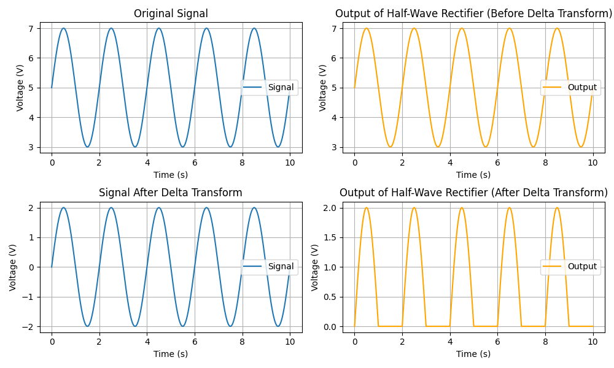

<!-- 
MIT License

Copyright (c) 2023 Carnegie Mellon University, Auton Lab

Permission is hereby granted, free of charge, to any person obtaining a copy
of this software and associated documentation files (the "Software"), to deal
in the Software without restriction, including without limitation the rights
to use, copy, modify, merge, publish, distribute, sublicense, and/or sell
copies of the Software, and to permit persons to whom the Software is
furnished to do so, subject to the following conditions:

The above copyright notice and this permission notice shall be included in all
copies or substantial portions of the Software.

THE SOFTWARE IS PROVIDED "AS IS", WITHOUT WARRANTY OF ANY KIND, EXPRESS OR
IMPLIED, INCLUDING BUT NOT LIMITED TO THE WARRANTIES OF MERCHANTABILITY,
FITNESS FOR A PARTICULAR PURPOSE AND NONINFRINGEMENT. IN NO EVENT SHALL THE
AUTHORS OR COPYRIGHT HOLDERS BE LIABLE FOR ANY CLAIM, DAMAGES OR OTHER
LIABILITY, WHETHER IN AN ACTION OF CONTRACT, TORT OR OTHERWISE, ARISING FROM,
OUT OF OR IN CONNECTION WITH THE SOFTWARE OR THE USE OR OTHER DEALINGS IN THE
SOFTWARE.
-->

# Delta Preprocessor Transform

The *Delta Preprocessor Transform* shifts the input signal by a fixed amount. The is defined as:

$$
x_{shifted_{i}} = x_{i} - \delta, \quad \forall i \in \{1, \dots, N\}, \quad \delta \in \mathbb{R}
$$

::: autonfeat.preprocess.transform.DeltaPreprocessor

## Examples

Consider a system that feeds in to a half-wave rectifier. Half-wave rectifiers are used to remove the negative portion of a signal and are use in many applications such as power supplies and AM radios. The half-wave rectifier is defined as:

$$
y_{i} = \max(x_{i}, 0) = 
\begin{cases}
x_{i}, & \text{if } x_{i} \geq 0 \\
0, & \text{if } x_{i} < 0
\end{cases} , \quad \forall i \in \{1, \dots, N\}
$$

where $x_{i}$ represents an element of the input signal, $y_{i}$ represents an element of the output signal, and $N$ is the number of elements in the signal. 

Suppose we want to apply the half-wave rectifer to just the AC part of a signal containing both AC and DC components, we can use the *Delta Preprocessor Transform* to eliminate the DC component.

### Define Signal, HWR System, and Preprocessor

Define a signal with the following parameters:

$$
signal_{i} = DC_{offset} + AC_{amp} \cdot \sin(2 \pi \cdot freq \cdot time_{i})
$$

$DC_{offset} = 5$ V

$AC_{amp} = 2$ V

$freq = 500$ Hz

$N = 1000$ samples

$T = 10$ s

```python
import numpy as np
import autonfeat as aft

# Define signal
time = np.linspace(0, 10, 1000) # secs
freq = 500                      # Hz
dc_offset = 5                   # V
ac_amp = 2                      # V

signal = dc_offset + ac_amp * np.sin(2 * np.pi * freq * time)

# Define half-wave rectifier
half_wave_rectifier = lambda x_i: np.maximum(x_i, 0)

# Define delta transform preprocessor
preprocessor = aft.preprocess.DeltaPreprocessor()
```

### Transform Signal

Transform the signal by the delta transform preprocessor and apply the half-wave rectifier. This will remove the DC component by setting $\delta = DC_{offset} = 5$ V.

```python
delta = dc_offset # Amount to shift by

# Preprocess signal
signal_transformed = preprocessor(signal, delta=delta)

# Apply half-wave rectifier
system_output = half_wave_rectifier(signal_transformed)
```

### Visualize Transform

Visualize the signal, the transformed signal, and the output of the half-wave rectifier with and without the delta transform preprocessor.

```python
import matplotlib.pyplot as plt

# Plot results
fig, (ax1, ax2) = plt.subplots(2, 2, figsize=(10, 6))

# Plot signal and output of half-wave rectifier (before delta transform)
ax1[0].plot(time, signal, label='Signal')
ax1[0].set_xlabel('Time (s)')
ax1[0].set_ylabel('Voltage (V)')
ax1[0].set_title('Original Signal')
ax1[0].grid(True)
ax1[0].legend()

ax1[1].plot(time, half_wave_rectifier(signal), color='orange', label='Output')
ax1[1].set_xlabel('Time (s)')
ax1[1].set_ylabel('Voltage (V)')
ax1[1].set_title('Output of Half-Wave Rectifier (Before Delta Transform)')
ax1[1].grid(True)
ax1[1].legend()

# Plot signal and output of half-wave rectifier (after delta transform)
ax2[0].plot(time, signal_transformed, label='Signal')
ax2[0].set_xlabel('Time (s)')
ax2[0].set_ylabel('Voltage (V)')
ax2[0].set_title('Signal After Delta Transform')
ax2[0].grid(True)
ax2[0].legend()

ax2[1].plot(time, system_output, color='orange', label='Output')
ax2[1].set_xlabel('Time (s)')
ax2[1].set_ylabel('Voltage (V)')
ax2[1].set_title('Output of Half-Wave Rectifier (After Delta Transform)')
ax2[1].grid(True)
ax2[1].legend()

plt.tight_layout()
plt.show()
```

We can observe how with the help of the *Delta Preprocessor Transform*, shifting the signal by the DC offset of the signal eliminates the DC component of the signal and allows the half-wave rectifier to only act on the AC component of the signal.



### Fun Fact

Half-wave rectifiers are equivalent to a [rectified linear unit](https://www.cs.toronto.edu/~fritz/absps/reluICML.pdf) i.e. the $ReLU$ activation function used in neural networks.


If you enjoy using [`AutonFeat`](../../../index.md), please consider starring the [repository](https://github.com/autonlab/AutonFeat) ⭐️.