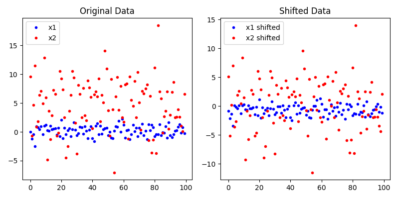

# Delta Std Preprocessor Transform

The *Delta Std Preprocessor Transform* shifts the input signal by the std of the signal. This is defined as:

$$
x_{shifted_{i}} = x_{i} - \sigma_{x}, \quad \forall i \in \{1, \dots, N\}
$$

For shifting signals by a custom $\delta$, see the [Delta Transform Preprocessor](delta_preprocessor.md). For more on how we compute the std of a signal, check out [std](../../functional/std.md) function.

::: autofeat.preprocess.transform.DeltaStdPreprocessor

## Examples

Here we look at an example where we shift two signals by their std to demonstrate the effect of the *Delta Std Preprocessor Transform*.

### Transform Signal

First, we define the signals as two normal distributions with different means and standard deviations. Then, we apply the *Delta Std Preprocessor Transform* to both signals.

A univariate normal distribution with mean $\mu$ and std $\sigma$ is defined as:

$$
\mathcal{N}(\mu, \sigma) = \frac{1}{\sigma \sqrt{2 \pi}} e^{-\frac{(x - \mu)^{2}}{2 \sigma^{2}}}
$$


```python
import numpy as np
import autofeat as aft

# Number of samples
n_samples = 100

# Generate sample data
x1 = np.random.normal(0, 1, n_samples)
x2 = np.random.normal(5, 5, n_samples)

# Define preprocessor
preprocessor = aft.preprocess.DeltaStdPreprocessor()

shifted_x1 = preprocessor(x1)
shifted_x2 = preprocessor(x2)
```

### Visualize Transform

Next, we visualize the effect of the transform on the signals.

```python
import matplotlib.pyplot as plt

# Plot original data
plt.figure(figsize=(8, 4))
plt.subplot(1, 2, 1)
plt.plot(x1, 'b.', label='x1')
plt.plot(x2, 'r.', label='x2')
plt.legend()
plt.title('Original Data')

# Plot shifted data
plt.subplot(1, 2, 2)
plt.plot(shifted_x1, 'b.', label='x1 shifted')
plt.plot(shifted_x2, 'r.', label='x2 shifted')
plt.legend()
plt.title('Shifted Data')

plt.tight_layout()
plt.show()
```

This can be seen in the figure below.




If you enjoy using `AutoFeat`, please consider starring the [repository](https://github.com/autonlab/AutoFeat) ⭐️.