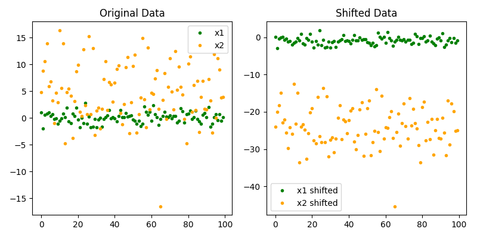

<!-- 
MIT License

Copyright (c) 2023 Carnegie Mellon University, Auton Lab

Permission is hereby granted, free of charge, to any person obtaining a copy
of this software and associated documentation files (the "Software"), to deal
in the Software without restriction, including without limitation the rights
to use, copy, modify, merge, publish, distribute, sublicense, and/or sell
copies of the Software, and to permit persons to whom the Software is
furnished to do so, subject to the following conditions:

The above copyright notice and this permission notice shall be included in all
copies or substantial portions of the Software.

THE SOFTWARE IS PROVIDED "AS IS", WITHOUT WARRANTY OF ANY KIND, EXPRESS OR
IMPLIED, INCLUDING BUT NOT LIMITED TO THE WARRANTIES OF MERCHANTABILITY,
FITNESS FOR A PARTICULAR PURPOSE AND NONINFRINGEMENT. IN NO EVENT SHALL THE
AUTHORS OR COPYRIGHT HOLDERS BE LIABLE FOR ANY CLAIM, DAMAGES OR OTHER
LIABILITY, WHETHER IN AN ACTION OF CONTRACT, TORT OR OTHERWISE, ARISING FROM,
OUT OF OR IN CONNECTION WITH THE SOFTWARE OR THE USE OR OTHER DEALINGS IN THE
SOFTWARE.
-->

# Delta Var Preprocessor Transform

The *Delta Var Preprocessor Transform* shifts the input signal by the var of the signal. The is defined as:

$$
x_{shifted_{i}} = x_{i} - \sigma^{2}_{x}, \quad \forall i \in \{1, \dots, N\}
$$

For shifting signals by a custom $\delta$, see the [`Delta Transform Preprocessor`](delta_preprocessor.md). For more on how we compute the var of a signal, check out [`var`](../../functional/var.md) function.

::: autonfeat.preprocess.transform.DeltaVarPreprocessor

## Examples

Here we look at an example where we shift two signals by their var to demonstrate the effect of the *Delta Var Preprocessor Transform*.

### Transform Signal

First, we define the signals as two normal distributions with different means and variances. Then, we apply the *Delta Var Preprocessor Transform* to both signals.

A univariate normal distribution with mean $\mu$ and var $\sigma$ is defined as:

$$
\mathcal{N}(\mu, \sigma) = \frac{1}{\sigma \sqrt{2 \pi}} e^{-\frac{(x - \mu)^{2}}{2 \sigma^{2}}}
$$


```python
import numpy as np
import autonfeat as aft

# Number of samples
n_samples = 100

# Generate sample data
x1 = np.random.normal(0, 1, n_samples)
x2 = np.random.normal(5, 5, n_samples)

# Define preprocessor
preprocessor = aft.preprocess.DeltaVarPreprocessor()

shifted_x1 = preprocessor(x1)
shifted_x2 = preprocessor(x2)
```

### Visualize Transform

Next, we visualize the effect of the transform on the signals.

```python
import matplotlib.pyplot as plt

# Plot original data
plt.figure(figsize=(8, 4))
plt.subplot(1, 2, 1)
plt.plot(x1, '.', color='green', label='x1')
plt.plot(x2, '.', color='orange', label='x2')
plt.legend()
plt.title('Original Data')

# Plot shifted data
plt.subplot(1, 2, 2)
plt.plot(shifted_x1, '.', color='green', label='x1 shifted')
plt.plot(shifted_x2, '.', color='orange', label='x2 shifted')
plt.legend()
plt.title('Shifted Data')

plt.tight_layout()
plt.show()
```

This can be seen in the figure below.




If you enjoy using [`AutonFeat`](../../../index.md), please consider starring the [repository](https://github.com/autonlab/AutonFeat) ⭐️.