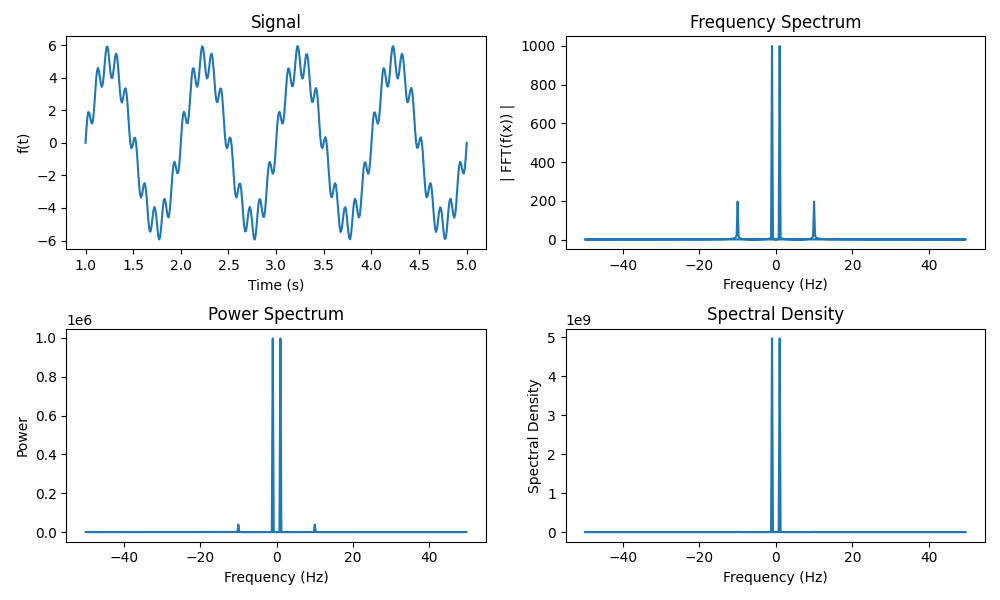

<!-- 
Author(s): Dhruv Srikanth
Email(s): dsrikant (at) andrew (dot) cmu (dot) edu
Acknowledgements:
Copyright (c) 2023 Carnegie Mellon University, Auton Lab
This code is subject to the license terms contained in the code repo.
-->

# Power Spectrum Transform Preprocessor

This preprocessor computes the power spectrum of a given signal, using the 1D Discrete Fourier Transform (DFT). The power spectrum is the squared magnitude of the Fourier transform of the signal. We first compute the DFT with the following:

$$
X_k = \sum_{n=0}^{N-1} x_n e^{-2\pi i k n / N}, \quad k = 0, \ldots, N-1.
$$

where $N$ is the number of samples and $k$ is the frequency index.

We can then compute the power spectrum as:

$$
P_k = |X_k|^2, \quad k = 0, \ldots, N-1.
$$

The power spectrum is useful for identifying important features in the signal that may not be visible in the time domain. 

The spectral density can be computed as:

$$
S_k = \frac{2}{f_s N} P_k, \quad k = 0, \ldots, N-1.
$$

The spectral density is the power spectrum normalized by the number of samples and sampling frequency. The spectral density is useful for comparing signals with different sampling rates and number of samples.

where $f_s$ is the sampling frequency.

## Limitations

> - The input signal must be real-valued.
> - The transform is sensitive to noise and outliers.

::: autonfeat.preprocess.transform.PowerSpectrumPreprocessor

## Examples

We define as signal as $f(t) = 2 \sin(2 \pi t) + \sin(10 \cdot 2 \pi t)$ for $t \in [1, 5]$ with a sampling rate of 100 samples per second. We then find the 1D DFT, power spectrum and spectral density of the signal.

### Transform Signal

```python
import numpy as np
from autonfeat.preprocess import DFTPreprocessor, PowerSpectrumPreprocessor

start_time = 1  # Start time in seconds
end_time = 5    # End time in seconds
sampling_rate = 100  # Number of samples per second
num_samples = int((end_time - start_time) * sampling_rate)

# Signal = 5 x sin(2 x pi x t) + sin(10 x 2 x pi x t)
time = np.linspace(start_time, end_time, num_samples)
freqs = np.fft.fftfreq(num_samples, 1 / sampling_rate)
signal = 5 * np.sin(2 * np.pi * time) + np.sin(10 * 2 * np.pi * time)

# Preprocess and transform signal
dft_preprocessor = DFTPreprocessor()
power_spectrum_preprocessor = PowerSpectrumPreprocessor()
freq_spectrum = dft_preprocessor(signal=signal)
power_spectrum = power_spectrum_preprocessor(signal=signal)
spectral_density = (2 / len(freqs)) * (power_spectrum ** 2)
```

### Visualize Transform

We then visualize the signal, its Fourier transform, the power spectrum and the spectral density. 

```python
import matplotlib.pyplot as plt

# Plot results
fig, ((ax1, ax2), (ax3, ax4)) = plt.subplots(2, 2, figsize=(10, 6))

# Plot signal
ax1.plot(time, signal)
ax1.set_xlabel("Time (s)")
ax1.set_ylabel("f(t)")
ax1.set_title("Signal")

# Plot frequency spectrum
ax2.plot(freqs, np.abs(freq_spectrum))
ax2.set_xlabel("Frequency (Hz)")
ax2.set_ylabel("| FFT(f(x)) |")
ax2.set_title("Frequency Spectrum")

# Plot power spectrum
ax3.plot(freqs, power_spectrum)
ax3.set_xlabel("Frequency (Hz)")
ax3.set_ylabel("Power")
ax3.set_title("Power Spectrum")

# Plot spectral density
ax4.plot(freqs, spectral_density)
ax4.set_xlabel("Frequency (Hz)")
ax4.set_ylabel("Spectral Density")
ax4.set_title("Spectral Density")

plt.tight_layout()
plt.show()
```




If you enjoy using [`AutonFeat`](../../../index.md), please consider starring the [repository](https://github.com/autonlab/AutonFeat) ⭐️.