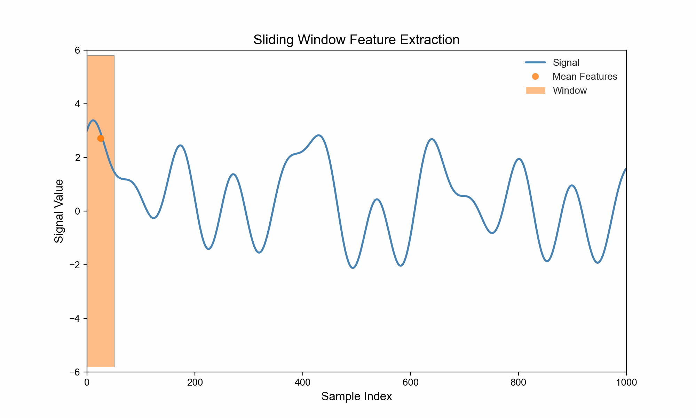

<!-- 
MIT License

Copyright (c) 2023 Carnegie Mellon University, Auton Lab

Permission is hereby granted, free of charge, to any person obtaining a copy
of this software and associated documentation files (the "Software"), to deal
in the Software without restriction, including without limitation the rights
to use, copy, modify, merge, publish, distribute, sublicense, and/or sell
copies of the Software, and to permit persons to whom the Software is
furnished to do so, subject to the following conditions:

The above copyright notice and this permission notice shall be included in all
copies or substantial portions of the Software.

THE SOFTWARE IS PROVIDED "AS IS", WITHOUT WARRANTY OF ANY KIND, EXPRESS OR
IMPLIED, INCLUDING BUT NOT LIMITED TO THE WARRANTIES OF MERCHANTABILITY,
FITNESS FOR A PARTICULAR PURPOSE AND NONINFRINGEMENT. IN NO EVENT SHALL THE
AUTHORS OR COPYRIGHT HOLDERS BE LIABLE FOR ANY CLAIM, DAMAGES OR OTHER
LIABILITY, WHETHER IN AN ACTION OF CONTRACT, TORT OR OTHERWISE, ARISING FROM,
OUT OF OR IN CONNECTION WITH THE SOFTWARE OR THE USE OR OTHER DEALINGS IN THE
SOFTWARE.
-->

# ⏳ AutonFeat ⌛

A high performance library for time series featurization. 


## What? 🙋

[`AutonFeat`](index.md) is a high-performant domain agnostic package for time series featurization. Despite the domain agnostic focus of the package, we recognize the benefit of domain knowledge and have included a few domain specific featurizers for popular domains like healthcare. With time series data, as with any data, it is often helpful to perform preprocessing before extracting information from it such as exploring the frequency domain as well as the time domain. We have provided a number of preprocessors that can transform the distribution or space to a form more amenable to certain featurizations. The package is lightweight, fast and easy to use. We hope you enjoy it! 🎉

Here's an illustration of what featurization looks like:



## Why? 🤔

To prevent others from reinventing the wheel, we have compiled a featurization library for dealing with time-series data. We have also included a number of preprocessors to transform the data into a form more amenable to certain featurizations. Finally, our goal was to make this package without too many dependencies and overhead. Here are some of our design objectives:

- **Simple**: The package must be easy to use and require as little user input as possible.
- **Interpretable**: The software abstractions must be intuitive, easy to understand and easy to debug.
- **Fast**: The tool must be fast enough to be used in large scale production environments.
- **Flexible**: The package must be modular and allow for easy extensibility to leverage community contributions.

## Assumptions 🧐

**Note**: We have made a few assumptions to start out with but we are working on making the package more flexible and robust. If you have any suggestions, please open an issue or PR! 🙂

> - The input data is a **1D** time series in the form of a **numpy array**.
> - If there are missing values, they must be represented by `np.nan` to be detected, otherwise, gaps in the time series are **not** detected.

## Installation 📦

```bash
pip install autonfeat
```

Check out our [quickstart guide](getting_started/installation.md) for more.

*Installing inside a python virtual environment or a conda environment is recommended.*

## Features 🧠

We provide a variety of features ranging from domain agnostic to domain specific (e.g. healthcare) [featurizers](api/features.md), as well as a number of [preprocessors](api/preprocess/preprocess.md) to transform the data into a form more amenable to certain featurizations. This list is constantly growing so please check back often! Feel free to contribute your own featurizers and open a PR! 🎉

## Contributing 🤝

We'd love to hear from you! If you've found anything missing, feel free to open an issue or PR! 🙂

Learn more about contributing [here](community/contributing.md).

## Authors 👨‍💻

[Dhruv Srikanth](https://dhruvsrikanth.github.io)

[Auton Lab](https://autonlab.org)

## License 📝

[](https://opensource.org/licenses/MIT)

For more details, check out the license [here](https://github.com/autonlab/AutonFeat/blob/main/LICENSE).


If you enjoy using [`AutonFeat`](index.md), please consider starring the [repository](https://github.com/autonlab/AutonFeat) ⭐️.
