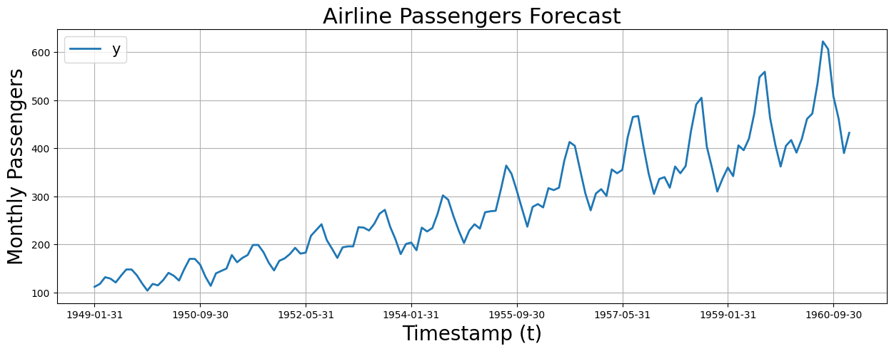
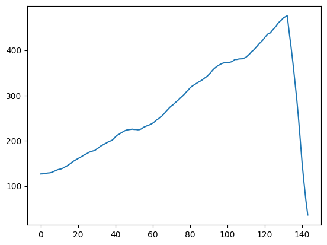

# Getting Started

In this tutorial we will show you how to install and use the `autofeat` package for single-feature extraction. We apply the package to the problem of ***time-series forecasting*** i.e. using past values of a time-series to predict future values.

## Table of Contents

- Install Packages
- Load Dataset
- Feature Extraction
- Fit Model
- Evaluate Model

Feel free to follow along in this Google Colab notebook - 

<a href="https://colab.research.google.com/github/autonlab/AutoFeat/blob/main/examples/tutorials/single_feature_extraction.ipynb" target="_parent"></a>

## Install Packages


```python
%%capture
!pip install git+https://github.com/autonlab/AutoFeat.git
```


```python
import autofeat as aft
import numpy as np
import pandas as pd
import matplotlib.pyplot as plt
```

## Load Dataset

List available datasets that we can use for this tutorial:


```python
print(aft.utils.datasets.list_datasets())
```

    ['air passengers']


Load the ***Airline Passengers*** dataset:


```python
air_passengers_df = aft.utils.datasets.get_dataset(name='air passengers')
air_passengers_df.head()
```


<div>
<style scoped>
    .dataframe tbody tr th:only-of-type {
        vertical-align: middle;
    }

    .dataframe tbody tr th {
        vertical-align: top;
    }

    .dataframe thead th {
        text-align: right;
    }
</style>
<table border="1" class="dataframe">
  <thead>
    <tr style="text-align: right;">
      <th></th>
      <th>unique_id</th>
      <th>ds</th>
      <th>y</th>
    </tr>
  </thead>
  <tbody>
    <tr>
      <th>0</th>
      <td>1.0</td>
      <td>1949-01-31</td>
      <td>112.0</td>
    </tr>
    <tr>
      <th>1</th>
      <td>1.0</td>
      <td>1949-02-28</td>
      <td>118.0</td>
    </tr>
    <tr>
      <th>2</th>
      <td>1.0</td>
      <td>1949-03-31</td>
      <td>132.0</td>
    </tr>
    <tr>
      <th>3</th>
      <td>1.0</td>
      <td>1949-04-30</td>
      <td>129.0</td>
    </tr>
    <tr>
      <th>4</th>
      <td>1.0</td>
      <td>1949-05-31</td>
      <td>121.0</td>
    </tr>
  </tbody>
</table>
</div>


Plot the time-series (it is often useful to visualize the data before we start modeling):


```python
fig, ax = plt.subplots(1, 1, figsize = (15, 5))
plot_df = air_passengers_df.set_index('ds')

plot_df[['y']].plot(ax=ax, linewidth=2)
ax.set_title('Airline Passengers Forecast', fontsize=22)
ax.set_ylabel('Monthly Passengers', fontsize=20)
ax.set_xlabel('Timestamp (t)', fontsize=20)
ax.legend(prop={'size': 15})
ax.grid()
```


    

    


## Feature Extraction

Set the parameters of the sliding window to perform feature extraction:

- `window_size`: the size of the sliding window
- `step_size`: the stride of the sliding window


```python
# Sliding Window
window_size = 12
step_size = 1
sliding_window = aft.SlidingWindow(window_size=window_size, step_size=step_size)
```

Define the feature we want to extract from the time-series. Here we will be considering the ***mean*** of the time-series values in each window. For a particular window of size $w$, the mean is defined as:

$$
\text{mean} = \frac{1}{w} \sum_{i=1}^{w} x_i
$$

where $x_i$ is the value of the time-series at time $i$.


```python
feature_extractor = aft.MeanTransform()
featurizer = sliding_window.use(feature_extractor)
features = featurizer(air_passengers_df['y'].values)
```


```python
print(features.shape)
# Plotting features
plt.plot(features)
```

    (144,)


    [<matplotlib.lines.Line2D at 0x142c98340>]


    

    


# Fit Model

$P( Y | X )$

$P(Y_{t+1} | Y_{t}, Y_{t-12})$


```python

```

# Evaluate Model


```python

```

If you enjoy using `AutoFeat`, please consider starring the [repository](https://github.com/autonlab/AutoFeat) ⭐️.
